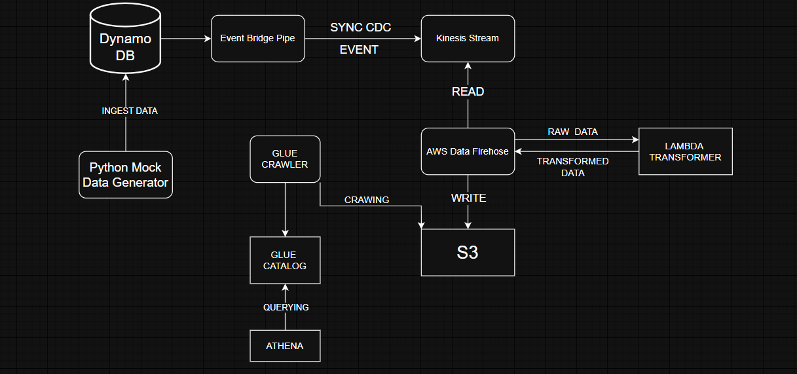
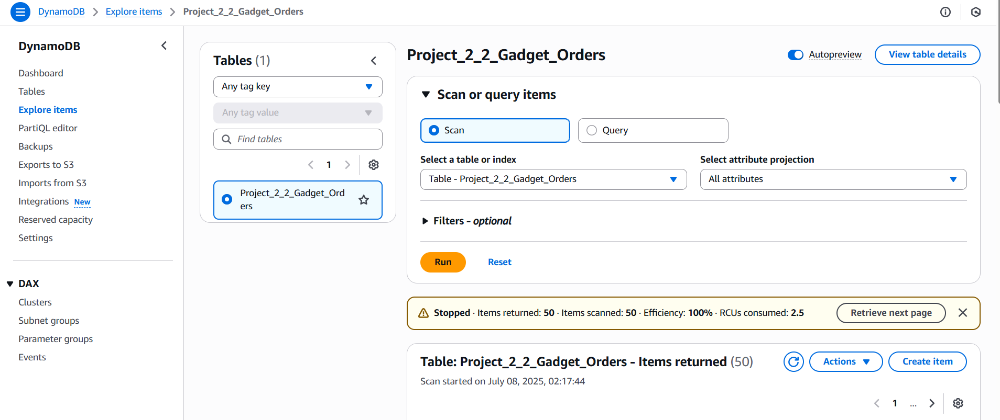
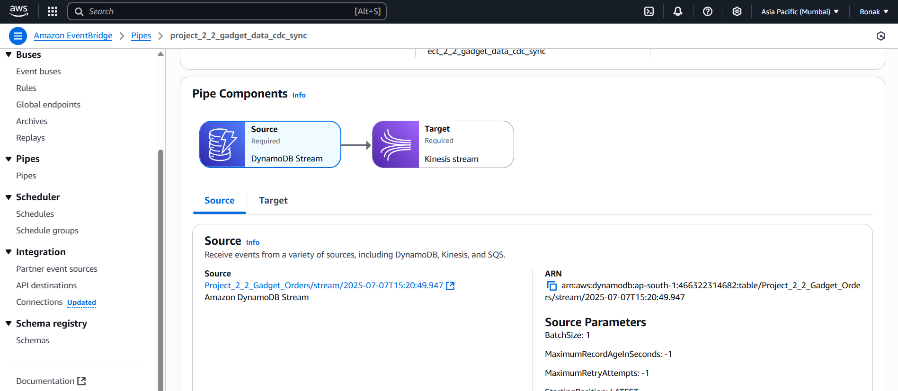
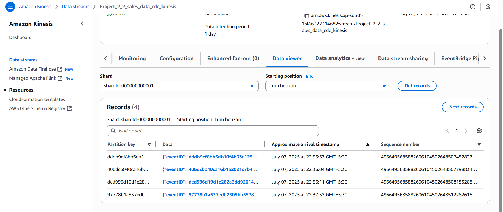
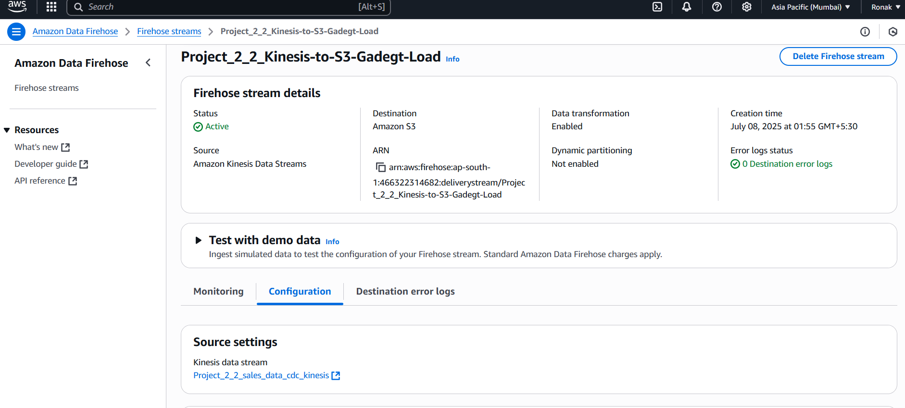
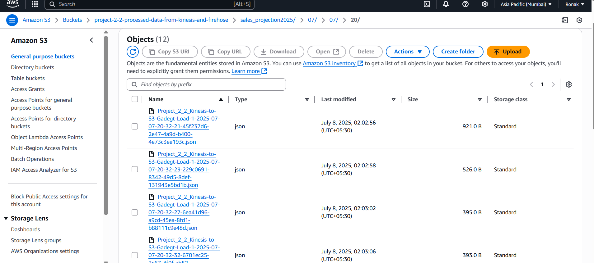
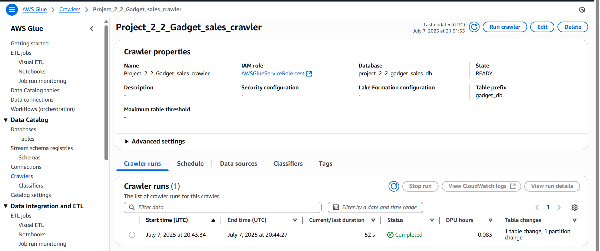
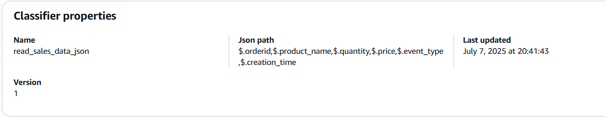
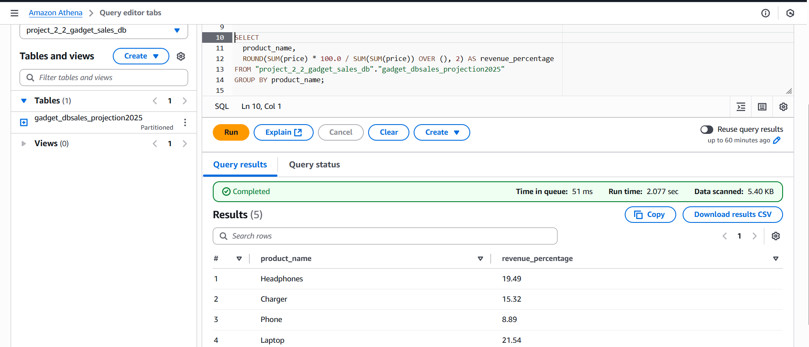

# Sales Data Streaming & Analytics Pipeline using AWS Serverless Services

This project demonstrates a real-time data pipeline for **sales data**, using AWS serverless architecture. It simulates data generation (mock data generation), ingestion, transformation, storage, and querying using fully managed AWS services.

---

## 📌 Architecture Overview

**Flow:**  
Mock Data → DynamoDB → EventBridge Pipes → Kinesis Stream → Kinesis Firehose → Lambda (Transform) → S3 → Glue Crawler → Athena (SQL Querying)

 <!-- Replace with your diagram -->

---

## 🛠️ Technologies & Services Used

- Python (for data generation and query scripts)
- AWS DynamoDB
- Amazon EventBridge Pipes
- Amazon Kinesis Data Streams
- Amazon Kinesis Data Firehose
- AWS Lambda
- Amazon S3
- AWS Glue Crawler & Data Catalog
- Amazon Athena

---

## 📄 Step-by-Step Implementation

### 1. 📦 Mock Data Generator (Python)

- A Python script generates sample sales data with fields like `order_id`, `timestamp`, `customer_id`, `amount`, etc.
- Data is inserted into **DynamoDB** table (`sales_data`).

📁 [mock_data_generator.py](dynamodb_mock_data_gen_latest.py)

---

### 2. 🔁 EventBridge Pipes

- Configured **EventBridge Pipes** to capture CDC (Change Data Capture) from the DynamoDB table.
- Routed changes into a **Kinesis Data Stream**.

---

### 3. 🔄 Kinesis Data Stream

- Stream collects real-time change events and sends them to **Kinesis Firehose**.

---

### 4. 🔥 Kinesis Firehose + Lambda Transformation

- Firehose delivers the streaming data to **S3**.
- Attached **Lambda function** to transform records (e.g., formatting, data enrichment).

  
📁 [Lambda_Transformer.py](lambda_transformer.py)

---

### 5. 🗂️ AWS S3

- Transformed sales data is stored in S3 in structured (CSV/JSON) format.

---

### 6. 🔍 AWS Glue & Classifiers

- A **Glue Crawler** scans the S3 bucket and catalogs the schema into AWS Glue Data Catalog.
- Includes custom **classifiers** if needed.

  
)

---

### 7. 🧠 Amazon Athena

- Athena is used to run SQL queries on the cataloged data directly from S3.
- Example queries are included in the script below:

---

